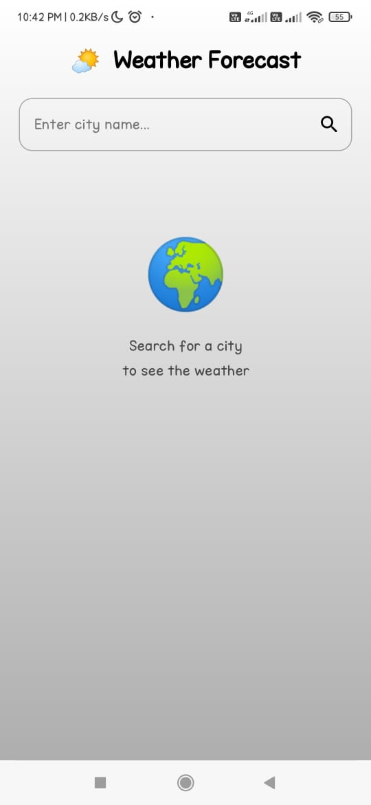
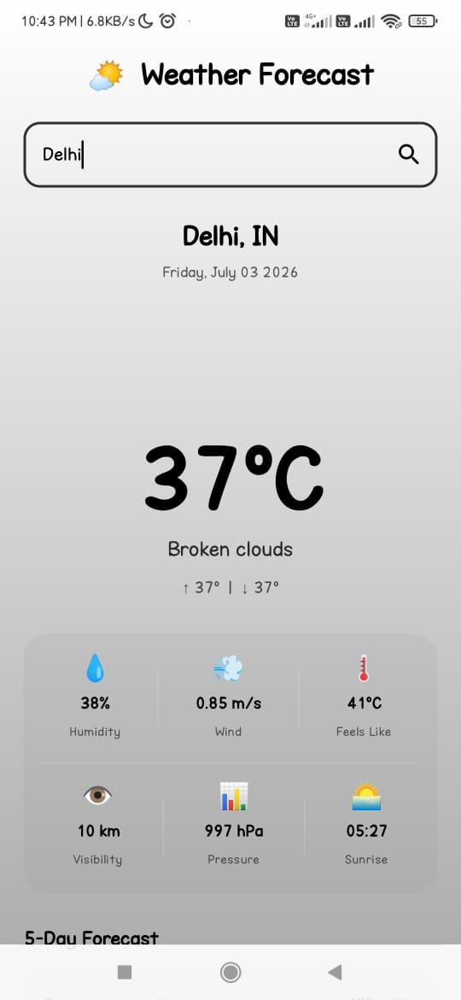
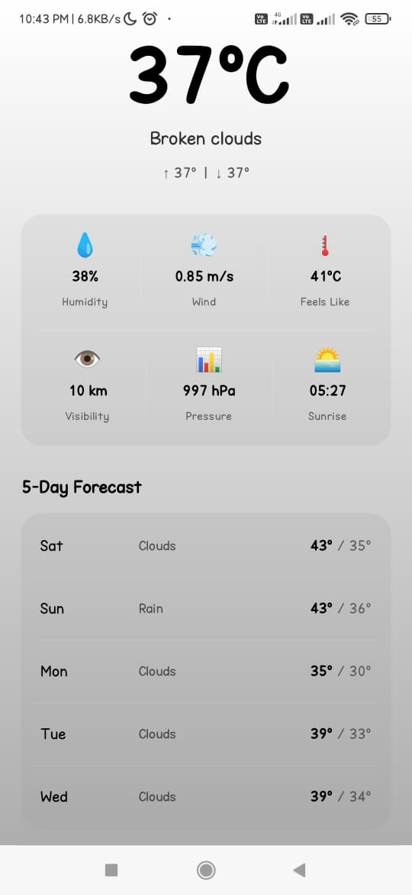

# 🌤️ Weather Forecast App

A simple Android Weather Forecast application built using **Kotlin** and **Jetpack Compose**. The app allows users to search for a city and view the current weather along with a 5-day forecast using the OpenWeatherMap API.

## 📱 Features

- 🔍 Search weather by city
- 🌡️ Current temperature
- ☁️ Weather condition
- 📅 5-Day forecast
- 💧 Humidity
- 🌬️ Wind speed
- 👁️ Visibility
- 🌅 Sunrise time
- 📊 Pressure
- ⚠️ Error handling

## 🛠️ Tech Stack

- Kotlin
- Jetpack Compose
- MVVM Architecture
- Retrofit
- Coroutines
- OpenWeatherMap API

## 📸 Screenshots

| Home | Weather |
|------|---------|
|  |  | |

## 🚀 Installation

1. Clone the repository.
   ```bash
   git clone https://github.com/yashkale-androidev/WeatherForcastApp.git
   ```

2. Open the project in Android Studio.

3. Add your OpenWeatherMap API key.

4. Build and run the app.

## 📚 What I Learned

- Building UI with Jetpack Compose
- API integration using Retrofit
- MVVM architecture
- State management with Coroutines
- Creating responsive Android applications

## 📄 License

This project is licensed under the MIT License.

## 👨‍💻 Author

**Yash Kale**

If you like this project, don't forget to ⭐ the repository!
